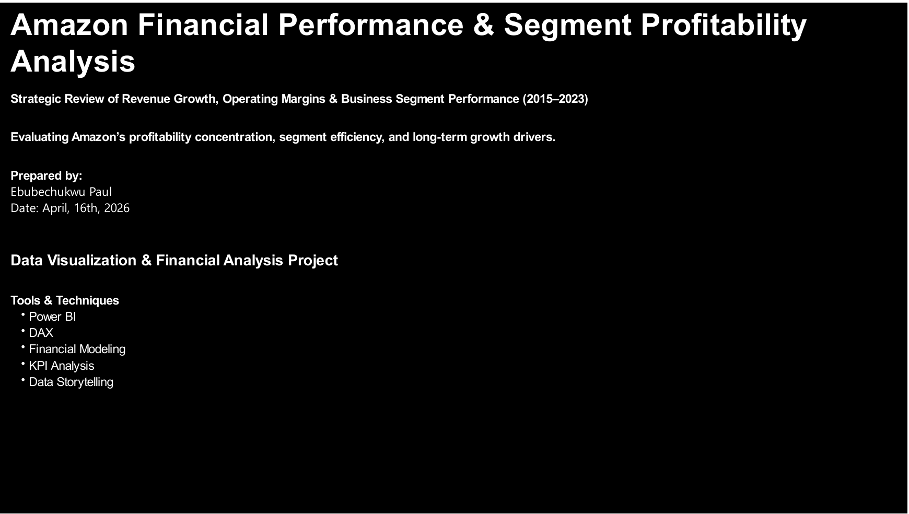
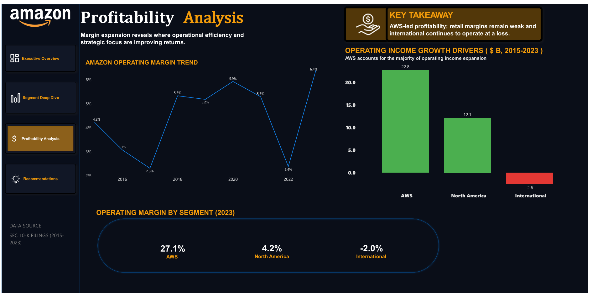
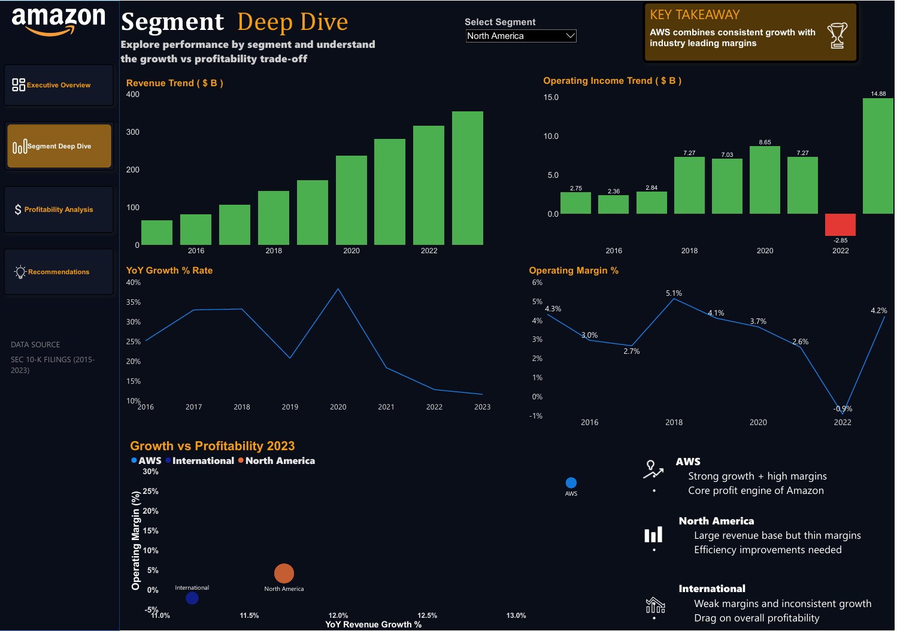
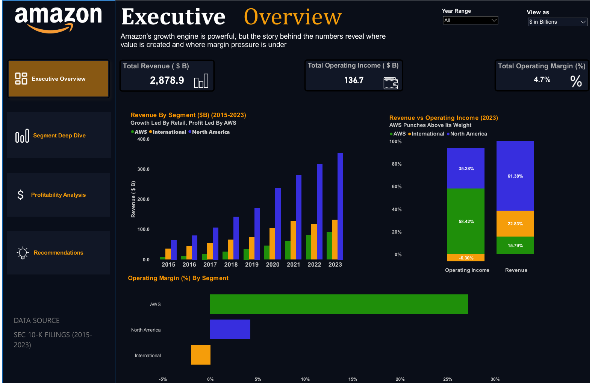
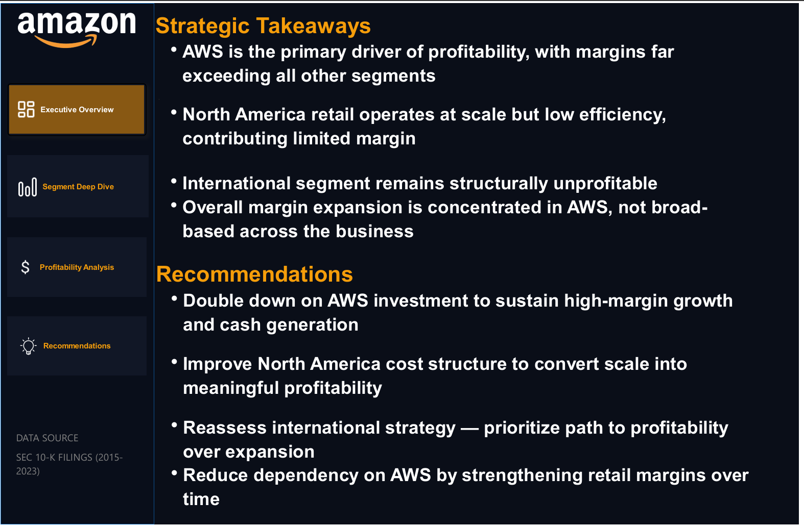

# Amazon Segment Performance Analysis

An end-to-end financial analytics and business intelligence project analyzing Amazon’s segment-level financial performance from 2015–2023 using SEC filings, Python-based data extraction, financial modeling, DAX calculations, and Power BI dashboard development.

This project evaluates how AWS transformed Amazon’s profitability profile while North America scaled operationally and International remained margin-constrained.

The project was built completely from scratch — beginning with raw SEC filings and ending with a fully interactive executive-level Power BI dashboard.

---

# Live Dashboard Demo

Watch the full dashboard walkthrough and project showcase on LinkedIn:

[](https://www.linkedin.com/posts/ebubechukwu-paul-7631502b8_dataanalytics-powerbi-python-activity-7464631715723042817-E9zG)

---

# Project Overview

This project follows a complete analytics engineering workflow:

1. SEC filing ingestion  
2. Financial table extraction  
3. Data cleaning and transformation  
4. Financial metric engineering  
5. Analytical dataset modeling  
6. Power BI dashboard development  
7. Executive-level strategic analysis  

The dashboard answers several key business questions:

- Which Amazon segment drives profitability?
- How has operating margin evolved over time?
- How dependent is Amazon’s profitability on AWS?
- Which segments contribute most to operating income growth?
- What operational weaknesses exist beneath Amazon’s overall growth story?

---

# Tech Stack

| Layer | Tools |
|---|---|
| Data Extraction | Python, Pandas |
| Source Data | Amazon SEC Filings (10-K) |
| Data Cleaning | Pandas, Jupyter |
| Modeling | CSV, SQL-ready schema |
| BI & Visualization | Power BI, DAX |
| Version Control | Git & GitHub |

---

# Dashboard Preview

## Executive Overview

<p align="center">
  
</p>

---

## Segment Deep Dive

<p align="center">
  
</p>

---

## Profitability Analysis

<p align="center">
  
</p>

---

## Strategic Takeaways & Recommendations

<p align="center">
  
</p>

---

# Repository Structure

```text
amazon-segment-analysis/
│
├── dashboard/
│   └── Amazon_Segment_Performance.pbix
│
├── data/
│   ├── raw/
│   │   └── sec_filings/
│   │       ├── AMZN_2022.html
│   │       └── AMZN_2023.html
│   │
│   ├── interim/
│   │   ├── extracted_tables/
│   │   │   ├── segment_raw_extracted.csv
│   │   │   └── segment_clean_extracted.csv
│   │   │
│   │   └── manual_inputs/
│   │       ├── manual_check_2022.csv
│   │       └── manual_check_2023.csv
│   │
│   └── processed/
│       ├── dim_date.csv
│       ├── dim_segment.csv
│       ├── growth_financials.csv
│       ├── kpi_financials.csv
│       └── segment_financials.csv
│
├── notebooks/
│   ├── 01_sec_ingestion.ipynb
│   ├── 01_sec_ingestion.py
│   └── amazon_financial_notes.txt
│
├── sql/
│
├── docs/
│   └── images/
│
├── README.md
├── requirements.txt
└── .gitignore
```

---

# Data Engineering Pipeline

## 1. SEC Filing Ingestion

Amazon SEC 10-K filings were collected and stored locally for financial extraction and processing.

Key extracted metrics included:

- Revenue
- Operating Income
- Segment Performance
- Operating Margin
- Year-over-Year Growth

Segments analyzed:

- AWS
- North America
- International

---

## 2. Financial Table Extraction

Python notebooks and scripts were used to extract structured financial tables from raw SEC filing HTML documents.

### Extraction Tasks

- HTML parsing
- Financial table identification
- Segment-level metric extraction
- CSV generation
- Financial row standardization

---

## 3. Data Cleaning & Validation

Extracted financial tables required additional cleaning and reconciliation before modeling.

### Cleaning Operations

- Column normalization
- Data type correction
- Currency formatting
- Missing value handling
- Segment standardization
- Year normalization

### Validation Process

Manual validation files were created to verify extracted financial values against SEC disclosures.

This ensured:
- extraction accuracy
- metric consistency
- financial integrity

---

## 4. Processed Data Modeling

Cleaned datasets were transformed into structured analytical tables for Power BI consumption.

### Processed Datasets

#### `segment_financials.csv`

Core fact table containing:
- year
- segment
- revenue
- operating_income
- operating_margin

---

#### `growth_financials.csv`

Contains derived growth metrics including:
- revenue growth %
- operating income growth %
- margin expansion
- prior-year comparisons

---

#### `kpi_financials.csv`

Executive KPI table used for:
- dashboard cards
- profitability summaries
- strategic metrics

---

# Financial Metrics Engineered

Several financial KPIs were derived from raw filing data.

## Operating Margin %

```text
Operating Income / Revenue
```

---

## Revenue Growth %

```text
(Current Revenue - Previous Revenue) / Previous Revenue
```

---

## Operating Income Growth %

Used to evaluate profitability acceleration relative to revenue growth.

---

## Segment Contribution Analysis

Used to measure:
- operating income concentration
- profitability dependency
- segment efficiency
- contribution to margin expansion

---

# Power BI Dashboard Development

The transformed datasets were imported into Power BI for modeling and dashboard development.

### Dashboard Features

- Multi-page executive dashboard
- Dynamic KPI cards
- DAX-based financial calculations
- Segment profitability analysis
- Interactive filtering
- Margin trend analysis
- Strategic recommendation framework

---

# Dashboard Pages

## 1. Executive Overview

High-level financial performance summary including:
- revenue growth trends
- operating income analysis
- executive KPI cards
- year-over-year comparisons

### Key Insight

Amazon experienced substantial revenue growth, but profitability expansion remained more volatile.

---

## 2. Segment Deep Dive

Segment-level analysis across:
- AWS
- North America
- International

Visuals focused on:
- segment revenue comparison
- operating income contribution
- growth analysis
- operational efficiency

### Key Insight

AWS consistently outperformed all other segments in profitability and margin efficiency.

---

## 3. Profitability Analysis

Focused analysis of:
- operating margin trends
- segment profitability
- profitability concentration
- growth vs profitability relationships

### Key Insight

Amazon’s profitability profile is heavily concentrated in AWS while retail margins remain structurally weaker.

---

## 4. Strategic Takeaways & Recommendations

Executive-style conclusion page translating financial analysis into strategic implications.

### Strategic Takeaways

- AWS is the primary profitability engine
- North America retail operates at low margins despite scale
- International remains structurally unprofitable
- Margin expansion is concentrated rather than diversified

### Recommendations

- Continue prioritizing AWS investment
- Improve retail operational efficiency
- Reassess international profitability strategy
- Reduce long-term dependency on AWS profitability concentration

---

# DAX & Analytical Logic

Custom DAX measures were created for:

- operating margin calculations
- revenue growth analysis
- operating income growth
- segment benchmarking
- dynamic KPI generation
- profitability comparisons

### Example DAX Measure

```DAX
Operating Margin % =
DIVIDE(
    SUM(growth_financials[operating_income]),
    SUM(growth_financials[revenue])
)
```

---

# Technical Challenges Solved

The project involved several analytical and modeling challenges, including:

- SEC extraction inconsistencies
- financial data normalization
- manual reconciliation workflows
- DAX filter context issues
- circular dependency errors
- profitability modeling
- dashboard optimization
- visual restructuring

Several overly complex visual approaches were intentionally simplified to improve:
- maintainability
- analytical clarity
- executive readability

---

# Key Business Insights

## AWS Drives Profitability

AWS contributes disproportionately to Amazon operating income despite representing a smaller share of total revenue.

---

## North America Scaled Efficiently

North America demonstrated strong operational leverage and margin recovery post-2022.

---

## International Remains Margin-Constrained

International operations remained weak from a profitability perspective and negatively impacted consolidated margins.

---

## Margin Expansion Was Operationally Driven

Amazon’s margin recovery was driven primarily by:
- AWS scale efficiency
- cost optimization
- operational discipline
- post-pandemic normalization

---

# Skills Demonstrated

## Data Engineering
- SEC filing ingestion
- HTML table extraction
- data cleaning
- transformation pipelines
- structured dataset modeling

---

## Financial Analysis
- margin analysis
- profitability analysis
- growth decomposition
- strategic business evaluation

---

## Power BI & DAX
- dashboard architecture
- advanced DAX measures
- dynamic KPI modeling
- financial visualization

---

## Business Intelligence
- executive reporting
- data storytelling
- strategic recommendations
- analytical dashboard development

---

# Future Improvements

Potential future extensions include:

- automated SEC API ingestion
- PostgreSQL warehouse integration
- dbt transformation pipelines
- forecasting models
- valuation analytics
- peer benchmarking against Microsoft and Google Cloud

---

# How to Run

## Clone Repository

```bash
git clone https://github.com/YOUR_USERNAME/amazon-segment-analysis.git
```

---

## Install Dependencies

```bash
pip install -r requirements.txt
```

---

## Open Dashboard

Open:

```text
dashboard/Amazon_Segment_Performance.pbix
```

using Power BI Desktop.

---

# Author

Built by **pauleTL**

Focused on financial analytics, business intelligence, data engineering, and strategic dashboard development.
